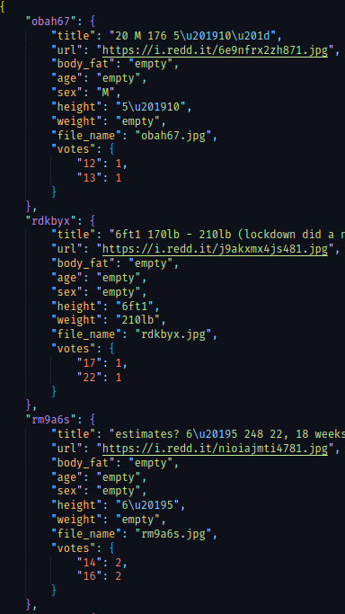
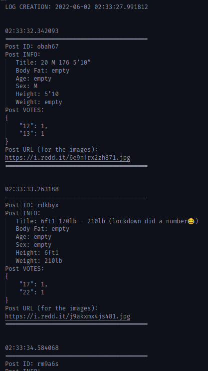

# GMBF Data Assistant

## Intro
This is a "data assistant" for the *r/guessmybf* subreddit. It uses praw, urllib, and maybe some other stuff.
In this repo, the following features are available:
* A scraper for use with r/guessmybf
* A 'logger' of sorts, not very smart
* A data cleaner
    * That subreddit is not very heavily regulated, there is no standard format for the submissions.
    * You can check out some examples in the notes.txt file.

## Purpose
I will be using this to try and train a model which can predict body fat percentage. (I haven't seen this before, so I guess I'm good.)

## Dependencies
* PRAW
```
pip install praw
```

## To run
Git clone this repository.
Cd into r_gmbf_data_assistant.
Issue the command:
```
python app.py
```

## Examples

valid_posts.json and log.txt output files.
<figure>
    
    
</figure>

## Limitations
* Skillz
* School and work is hard, life is hard

## TODO
* ~~Create a separate file for user input, instead of just having everything in app.py, as I almost forgot to remove my personal info.~~ DONE
* Maybe I can build a simple tool to manually filter the results, since some links are galleries, with pictures from different angles, and I only plan to be able to predict BF percentage from the front. This could be some practice with qt.
* Learn some regex? I'm not really sure if it would be useful, and I kinda like how the data population file looks like.
* Documentation, I'm kinda forgetting what everything does.
* ~~Upload some example pictures.~~ DONE

.json file output
